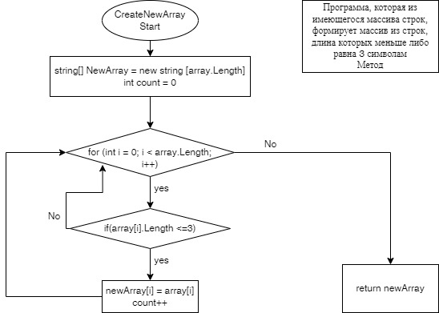

# Задача: 
_Написать программу, которая из имеющегося массива строк формирует массив из строк, длина которых меньше либо равна 3 символам_ 
# Решение:
_Сперва, объявляется массив с определенным количеством строк разной длинны. Для решения поставленной задачи сформируем возвратный метод:_
## Описание метода:   
_Создаем массив с таким размером, как и искомый, поскольку максимальный его размер ни при каких условиях не будет превышать размер заданного массива. Затем вводится переменная count, в которую будут записываться строки, отвечающие условию, приведенному ниже. Далее запускаем цикл for для проверки каждого индекса изначального массива, при этом внутри цикла запускаем проверку с условием, если длина индекса изначального массива будет меньше или равна 3, то заносим данный индекс во второй массив и увеличиваем count. Данная проверка длится до конца цикла._

## Блок-схема
 

